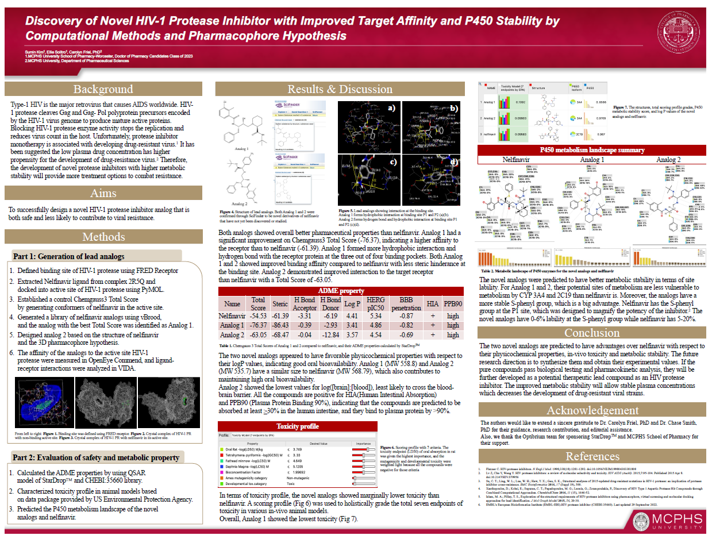
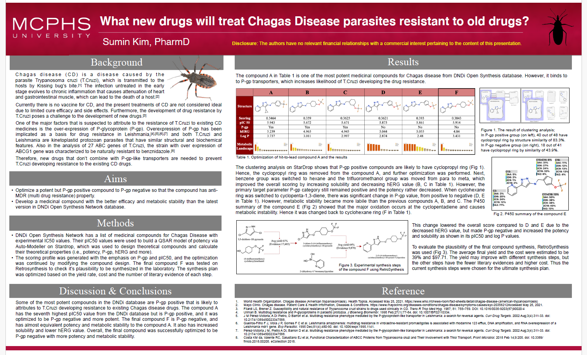
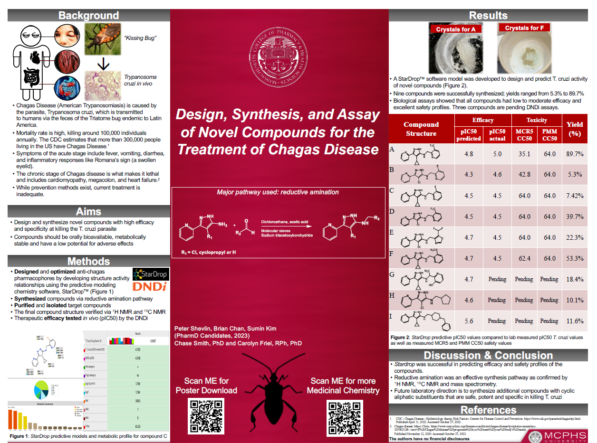

Here's a summary selection of recent and ongoing work.

------------------------------------------------------------------------

## Project Table

| Project | Status | Type | Tools / Skills | Summary |
|--------------|--------------|--------------|--------------|-----------------|
| **Building repository for legacy data** | 🔄 In progress | Research | R, data cleaning, data integration, scientific writing | Reprocessing the epidemiological data from 80's and 90's to GDPR compliant repository. |
| **Quantifying uncertainty in Cascade framework** | 🔄 In progress | Thesis | R, exploratory analysis, scientific writing, research protocol | MSc thesis on improving Cascade framework. A mathematical model of effective treatment of malaria under 5 years. |
| **Modeling Covid-19 Epidemics** | ✅ Completed | Learning | R, SEIR models, data viz | Simulated covid outbreaks in global environment and visualized epidemic curves. |
| **Scoping Review for systematic review** | 🟡 Ongoing | Review | Scoping review, Data extraction | Assisting with a systematic review about sexual violence in war. |

------------------------------------------------------------------------

## Publications

Hobbs NP, Kim S, Masserey T, Chitnis N (2026) Impact of insecticide resistance evolution on malaria vector control. PLOS Computational Biology 22(8): e1014612. <https://doi.org/10.1371/journal.pcbi.1014612>

------------------------------------------------------------------------

## Posters

**“Discovery of Novel HIV-1 Protease Inhibitor with Improved Target Affinity and P450 Stability by Computational Methods and Pharmacophore Hypothesis”**, presented at *Center for Research and Discovery Student Research Conference*, Apr 2023, Boston, MA.

**“Discovery and Synthesis of Novel Drug Compounds for the Treatment of Chagas Disease,** presented at *ASHP MidYear Clinical Conference*, Dec 2022, Las Vegas, NV.

